### **Post Mortem по инциденту с веб-сервером**  

#### **Описание инцидента**  
На сервере работал веб-сервис, однако в определенный момент он перестал отвечать на запросы. Попытка перейти на сайт по IP-адресу не дала результата.  
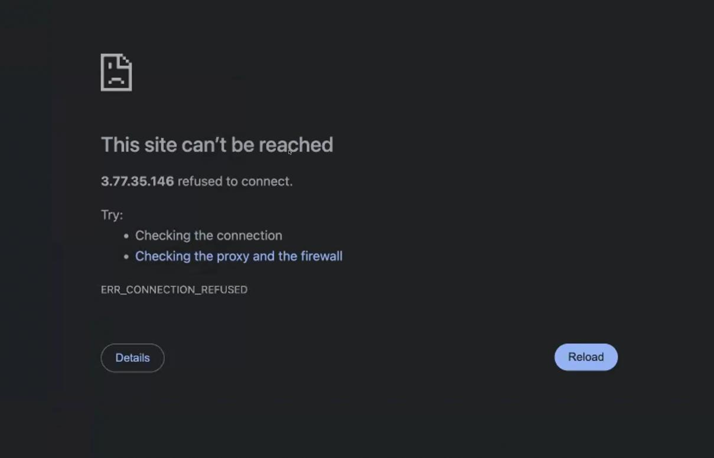
#### **Причины инцидента**  
1. **Переполнение дискового пространства** – лог-файлы веб-сервера заполнили весь доступный объем диска, из-за чего система не могла выполнять критически важные операции.  
2. **Файл конфигурации приложения находился в неправильном месте**, что привело к невозможности его запуска.  
3. **Некорректная настройка задачи в cron**, которая создавала архивы лога каждую минуту, тем самым еще больше заполняя диск.  

#### **Шаги по восстановлению сервиса**  
1. **Подключение к серверу через SSH:**
      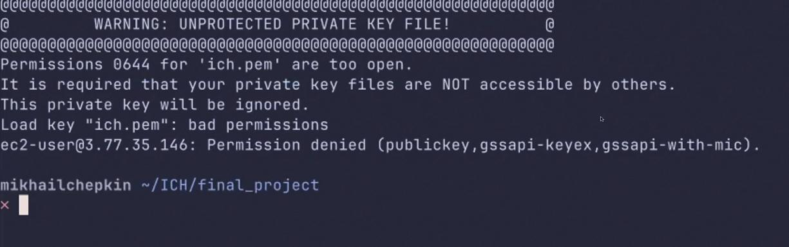  
   - Исправление прав доступа к приватному ключу.
      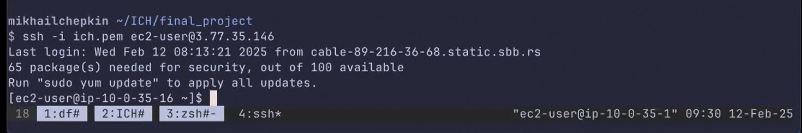    
   - Успешное подключение к серверу.  

2. **Диагностика состояния сервиса:**  
   - Проверка статуса веб-сервера `httpd` – он был выключен.
     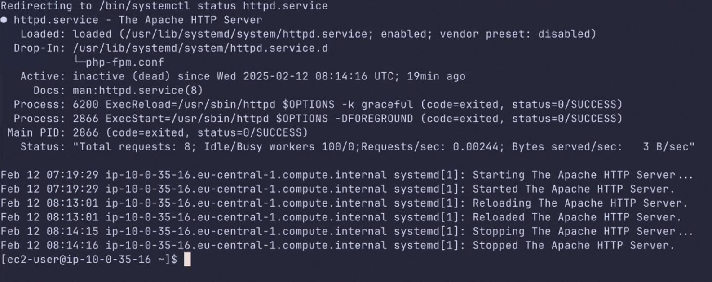   
   - Попытка его запуска.
      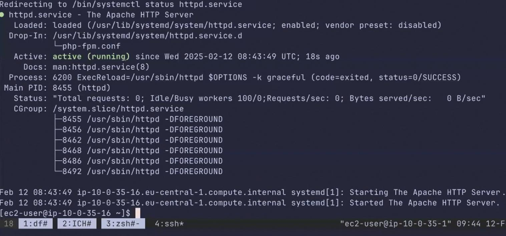 
        

3. **Поиск причины сбоя:**  
   - Проверка загрузки процессора (`top`) – нагрузка в норме. 
      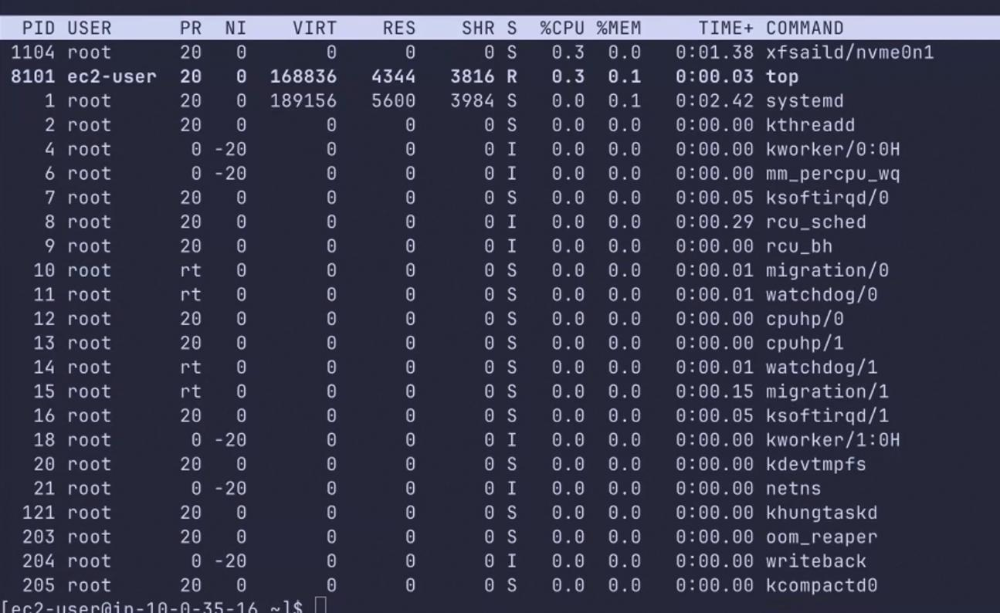   
   - Проверка свободного дискового пространства (`df -h`) – места нет.  
      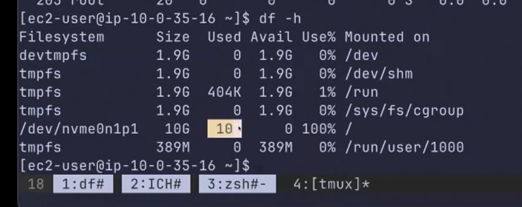  
   - Поиск крупных файлов (`find / -type f -size +100M`) – обнаружен огромный лог-файл `/var/log/httpd/access_log`.  
      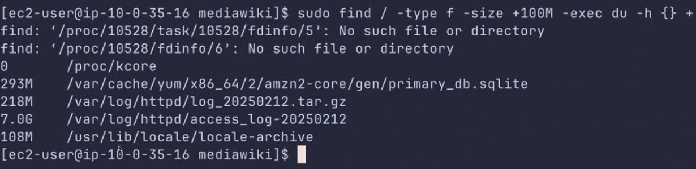  

4. **Очистка дискового пространства:**  
   - Удаление лог-файла `/var/log/httpd/access_log`.  
   - Проверка доступного места – теперь достаточно для работы.  

5. **Исправление расположения конфигурационного файла:**  
   - Перемещение `LocalSettings.php` в `/var/www/html/mediawiki/`.  

6. **Настройка механизма очистки логов:**  
   - Создан и настроен скрипт `/home/ec2-user/backup_logs.sh`, который:  
     - Архивирует логи.  
     - Удаляет старые архивы.  
   - Добавлено задание в cron для ежедневного выполнения.  

#### **Результаты**  
- Веб-сервис успешно восстановлен.
      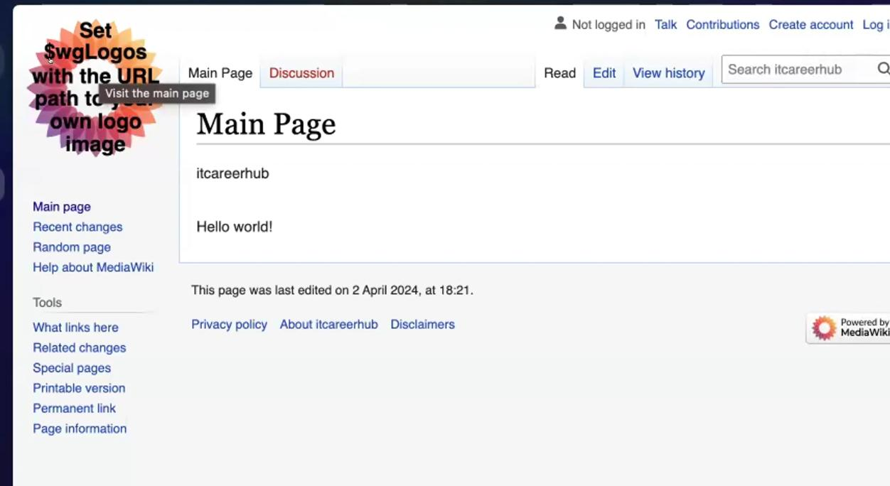    
- Проблема переполнения диска устранена.

- Настроен механизм предотвращения подобных инцидентов в будущем.  

#### **Рекомендации по предотвращению подобных инцидентов**  
1. **Мониторинг дискового пространства:**  
   - Настроить автоматические уведомления при низком свободном месте (`df -h`).  
2. **Ограничение размера лог-файлов:**  
   - Настроить `logrotate` для автоматического управления логами веб-сервера.  
3. **Корректная настройка cron-задач:**  
   - Проверять корректность настроенных задач и избегать слишком частого выполнения архивирования.  
4. **Резервное копирование конфигурационных файлов:**  
   - Создать резервные копии критически важных файлов (`LocalSettings.php`).  

**Вывод:** инцидент произошел из-за нехватки дискового пространства, вызванной некорректным хранением логов. Принятые меры позволили восстановить работоспособность системы и минимизировать вероятность повторения аналогичных проблем.

  
  
  
  
  
  
  
  
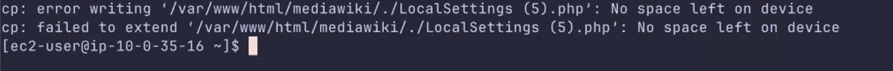  
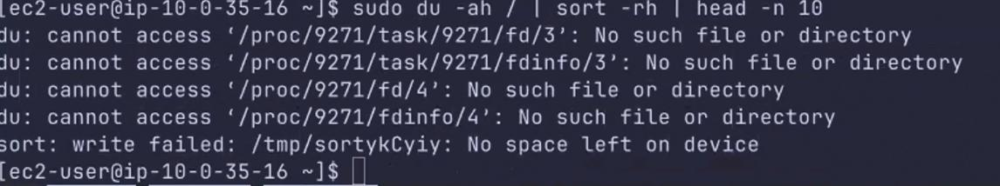  
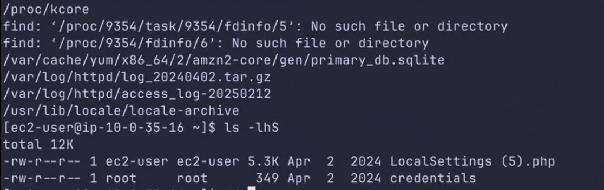  
  
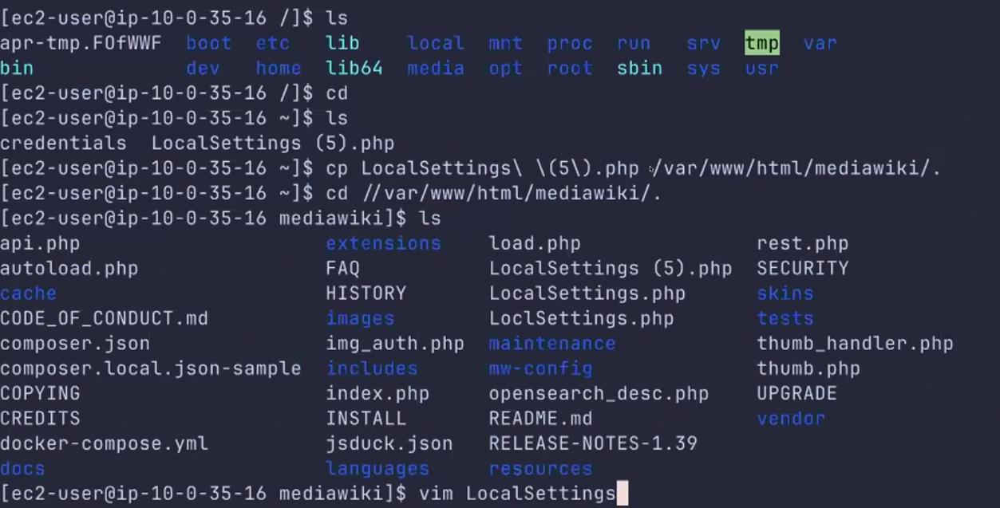  
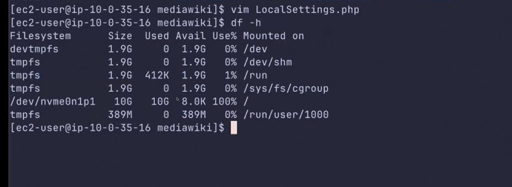  
  
  
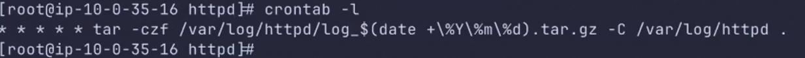    